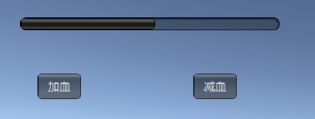
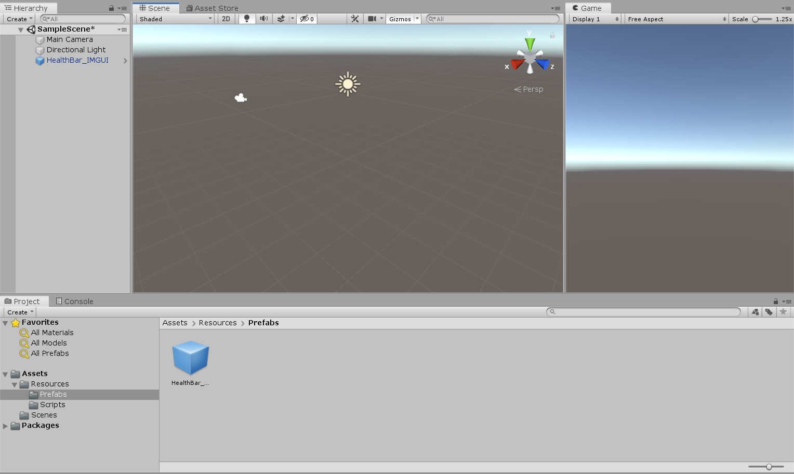
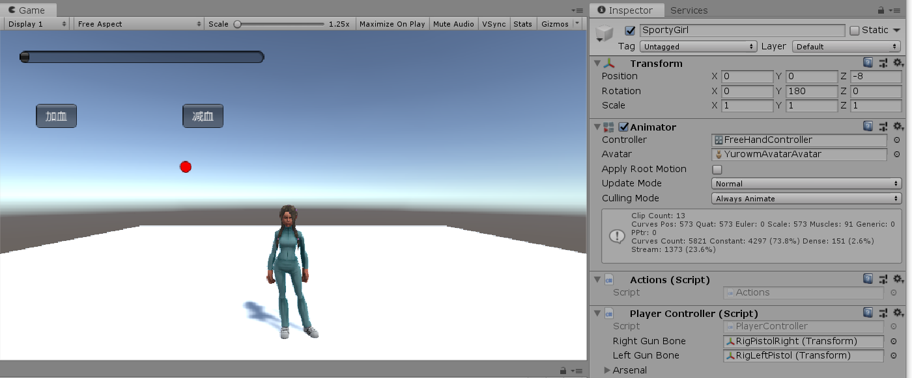
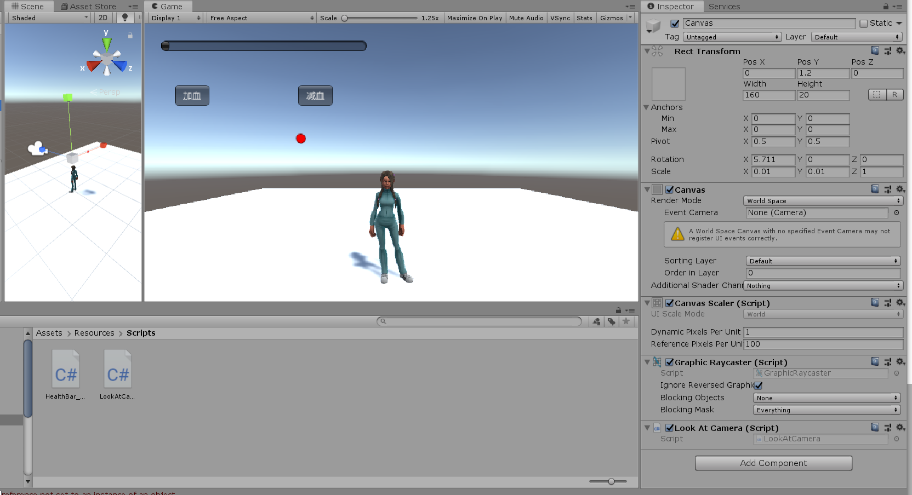
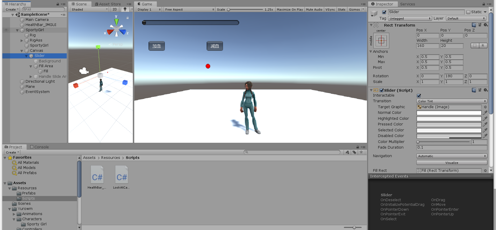
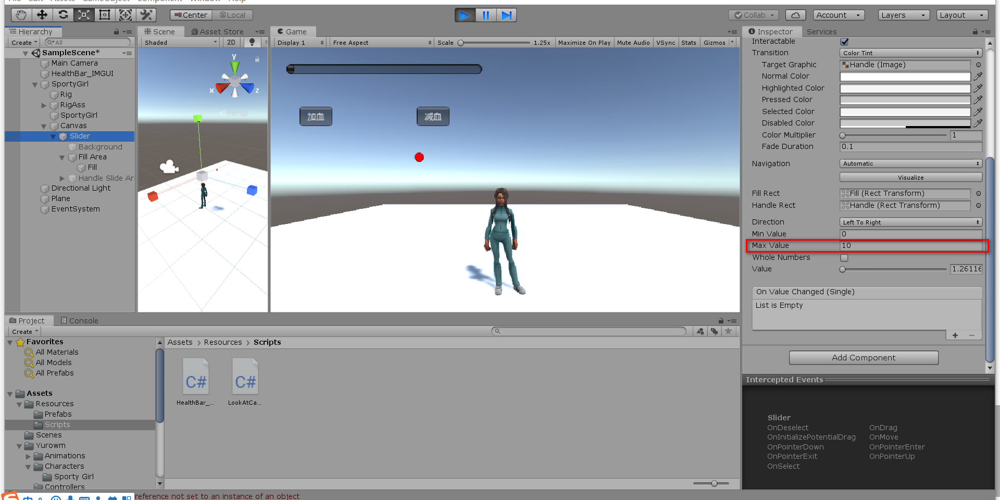
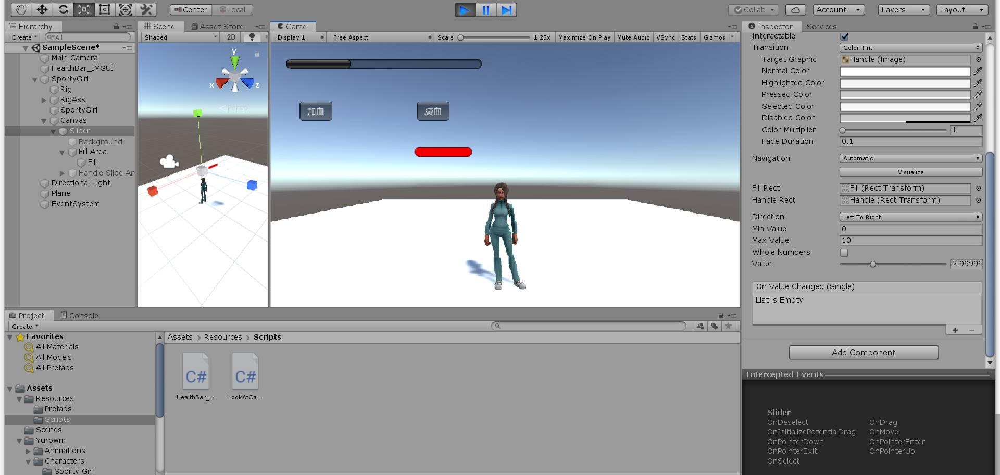
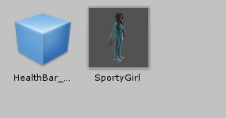
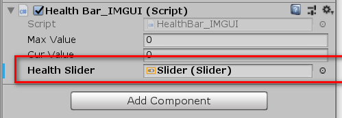

# 血条设计 Health Bar

github 项目地址 <https://github.com/JennySRH/Health-Bar-3DGAME>

游戏视频 <https://www.bilibili.com/video/av76306530/>

------

血条（Health Bar）的预制设计。具体要求如下

- 分别使用 IMGUI 和 UGUI 实现
- 使用 UGUI，血条是游戏对象的一个子元素，任何时候需要面对主摄像机
- 分析两种实现的优缺点
- 给出预制的使用方法


## IMGUI实现

 IMGUI（Immediate Mode GUI）及时模式图形界面。它是代码驱动的 UI 系统，没有图形化设计界面，只能在 OnGUI 阶段用 GUI 系列的类绘制各种 UI 元素，因此 UI元素只能浮在游戏界面之上。

参考前辈的博客<https://blog.csdn.net/Runner1st/article/details/80582780> 和相应的水平滚动条的API <https://docs.unity3d.com/ScriptReference/GUI.HorizontalScrollbar.html> 来实现IMGUI版的血条操作，可以通过按钮实现加血和减血的操作，并用插值的方法实现血条平滑变化。最后效果如下图：



实现很简单，直接上代码。

```csharp
using System.Collections;
using System.Collections.Generic;
using UnityEngine;

public class HealthBar_IMGUI : MonoBehaviour
{
    // 最大血量
    public float MaxValue = 10.0f;
    // 当前血量
    public float CurValue;
    private float LerpValue;
    private void Start()
    {
        // 默认最大血量是10.0，可以调整
        MaxValue = 10.0f;
        // 初始血量为1.0
        CurValue = 1.0f;
        LerpValue = 1.0f;
    }
    void OnGUI()
    {
        GUI.HorizontalScrollbar(new Rect(25, 25, 300, 50), 0.0f, CurValue, 0.0f, MaxValue);

        if (GUI.Button(new Rect(45, 90, 50, 30), "加血"))
        {
            LerpValue += 1.0f;
            if(LerpValue > 10.0f)
            {
                LerpValue = 10.0f;
            }
        }
        if (GUI.Button(new Rect(225, 90, 50, 30), "减血"))
        {
            LerpValue -= 1.0f;
            if (LerpValue < 0.0f)
            {
                LerpValue = 0.0f;
            }
        }
        CurValue = Mathf.Lerp(CurValue, LerpValue, 0.05f);
    }
}
```

将上面的脚本挂载到空物体上，然后将空物体拖入预制Prefabs中，下次使用的时候直接拖出就可以了。




## UGUI实现

依旧是参考了前辈的博客<https://blog.csdn.net/Runner1st/article/details/80582780> 。

首先从Unity的Assets store中下载`Sportygirl`，然后导入到Assets中。将预制体拖到场景中，保持摄像头的初始位置不变，调整人物的位置，使人物正对摄像头。



然后给人物增加Canvas组件，调整参数如下所示：



给`Canvas`添加`Slider`组件，调整参数如下所示



设置`Slider`组件的Max Value为10.0，也就是血条的最大值为10.0



disable Background和Handle Slider Area，然后调整Fill Area的Fill中Image的颜色为红色。

为了便于操作，将`Slider`的`value`跟之前的IMGUI的`CurValue`通过脚本关联起来。

更改之前的脚本，增加参数

```csharp
// 只是为了方便
public Slider healthSlider;
```

然后在更新`CurValue`的同时，把`CurValue`的值赋给`Slider`的`value`

```csharp
healthSlider.value = CurValue;
```

为了让血条一直面对摄像头，给Canvas增加脚本

```csharp
using System.Collections;
using System.Collections.Generic;
using UnityEngine;

public class LookAtCamera : MonoBehaviour
{
    void Update()
    {
        this.transform.LookAt(Camera.main.transform.position);
    }
}

```

最后效果




## IMGUI和UGUI的优缺点对比

下面内容来自老师的课程网站 <https://pmlpml.github.io/unity3d-learning/09-ui.html>

就本次的实际体验而言，做简单的UI系统IMGUI简洁方便，但是调试过程确实困难。

------


Unity 目前支持三套完全不同风格的 UI 系统：

- 4.0 及以前 - IMGUI（Immediate Mode GUI）及时模式图形界面。它是代码驱动的 UI 系统，没有图形化设计界面，只能在 OnGUI 阶段用 GUI 系列的类绘制各种 UI 元素，因此 UI元素只能浮在游戏界面之上。
- 5.0 及以后 - Unity GUI / UGUI 是面向对象的 UI 系统。所有 UI 元素都是游戏对象，友好的图形化设计界面， 可在场景渲染阶段渲染这些 UI 元素。
- 2018.3 及以后 - UXML（unity 扩展标记语言）。基于 IMGUI 的 AXML 包装，方便移动应用开发者入门。

### IMGUI 过时了？

按 Unity 官方说法，IMGUI 主要用于以下[场景](https://docs.unity3d.com/Manual/GUIScriptingGuide.html)：

- 在游戏中创建调试显示工具
- 为脚本组件创建自定义的 Inspector 面板。
- 创建新的编辑器窗口和工具来扩展 Unity 环境。

IMGUI系统通常不打算用于玩家可能使用并与之交互的普通游戏内用户界面。为此，应该使用 Unity 的基于 GameObject 的 UGUI 系统。

显然，如果不做复杂的界面，如下代码简单易用的代码是程序员喜欢的：

因此，掌握了解 IMGUI 是非常必要：

- 新手 UI 入门容易，帮助新手理解引擎的游戏循环
- 高级程序员，创建在线调试环境
- 工具开发者，定义 Unity 新的编程工具

### UGUI 的产生与优势

随着游戏开发的普及，为了让设计师也能参与参与程序开发，从简单的地图编辑器、菜单编辑器等工具应运而生。设计师甚至不需要程序员帮助，使用这些工具就可直接创造游戏元素，乃至产生游戏程序。除此之外，现代游戏 UI 必须要满足以下要求：

- 跨设备执行，自动适应不同分辨率
- UI 元素与游戏场景融为一体的交互
- 支持复杂的布局
- 多摄像机支持

以至于即使优秀的程序员在现代 UI 面前，传统代码驱动的 UI 面临开发效率低下，难以调试等问题。 对于 Unity 平台， 当 [NGUI](http://www.tasharen.com/?page_id=140): Next-Gen UI kit 的出现使得不依赖 Unity Pro 功能，使用所见即所得（WYSIWYG）设计工具，集成了 tweening 运动管理系统， 可以制作多数 2D 游戏，直接威胁了 Unity 的生意。 Unity 最终高薪聘了 NGUI 的主设计师，最终又分道扬镳，于是就有了 UGUI，青出于蓝而胜于蓝！

UGUI 的优势：

- 所见即所得（WYSIWYG）设计工具
- 支持多模式、多摄像机渲染
- 面向对象的编程

------


## 预制的使用

共有两个预制



HealthBar_IMGUI直接拖入场景即可使用。

SportyGril拖入场景后，再把SportyGril的Slider组件拖入HealthBar_IMGUI的脚本组件中的Health Slider。

